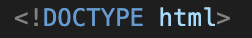
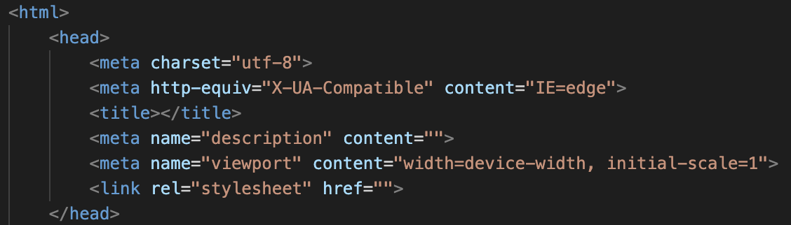

# Setting up your Boilerplate

1. [Getting Started With VSCODE](GettingStarted.md)
3. [Adding Content To Your Page](Content.md)
4. [Viewing and Testing Your Page](Testing.md)

Once you've created a new file in VSCODE, you will be prompted at the top of your document to select a language.  Click that line of text, and select "HTML" from the list on the first line of your new HTML file.  You can then copy from the image below to set up your file DOCTYPE line.

Once this line is complete, you'll want to make your header. The following code sets up your document with the basic "boilerplate code to ensure it runs properly.

Copy the following code onto a line in your header, and replace "your title here" with whatever you'd like: <title>your title here</title>

You may notice the line that says "link" and "stylesheet".  this is commonly used to connect a CSS file to your webpage, where you can stylize your page with sizing, framing, colors, etc. You can learn about CSS [here](https://www.w3schools.com/css/css_intro.asp).

You're now ready to move onto the content of your webpage.  [Continue](Content.md)
