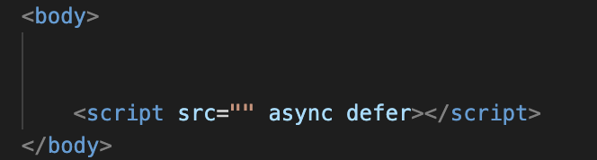
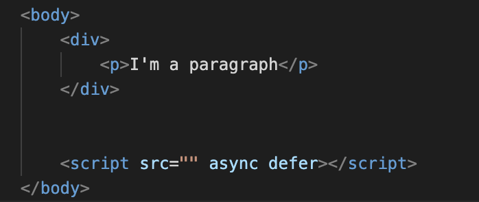

# Content

1. [Getting Started With VSCODE](GettingStarted.md)
2. [Setting Up Your BoilerPlate](BoilerPlate.md)
3. [Adding Content To Your Page](Content.md)
4. [Viewing and Testing Your Page](Testing.md)

Once your boilerplate is setup, you're ready to add headings and a body to your HTML file. 

First, under your header, copy and paste the following code to add a large heading under your page title: <h1>your heading here</h1>

Next, you can create a body for your webpage.  This is where most of your webpage is written, and where you would spend most of your time working on a webpages initial content layout. 

You'll notice the "script" line in the bottom of the body here.  This is commonly used to add a JavaScript file to your webpage to script actions and reactions to a user's clicks on your webpage.  Learn more about JavaScript [here](https://www.w3schools.com/js/js_intro.asp).

Inside the body of your webpage, you can add dividers, paragraphs and more.  Add a divider to your body,and then put a paragraph inside it like this.

